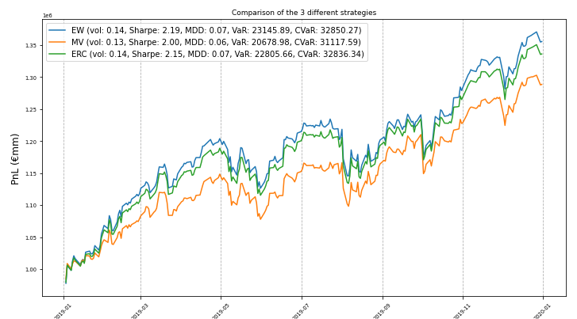

# Markowitz Portfolio Optimization 
This project was made during a course on Optimization in Finance with python with Pr O. Guéant. 
The aim was to analyze SBF120 stocks market data and to create performant portfolios using Markowitz Modern Portfolio Theory.
Various risk metrics are also computed along portfolios to have a better sense of the performance of them.

# Example
You can initiate a `Portfolio` instance by running this line of code: 
```python
portfolio = Portfolio('ERC')
```
Where here ERC refers to the Equal Risk contribution Portfolio. 

You can also plot the strategies with the following lines of code: 
```python
portfolio.illustrate()
```
Where you will get the following graph.


